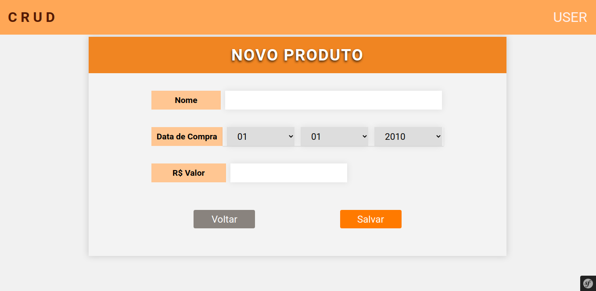

# symfony2.8-crud
Crud simples em Symfony, explorando o uso do twig e construção de aplicações monolíticas.

### Tecnologias
##### BACK
- PHP 7.1
- Mysql
- Symfony 2.8
    1. Doctrine
    2. Forms

	
#### Front
- html
- css
- Twig
- Forms

## Capturas
### Listagem

### Criação

### Edição/Remoção

